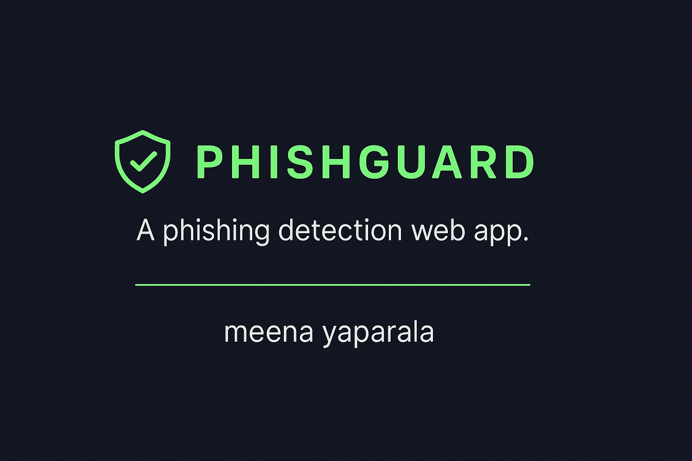
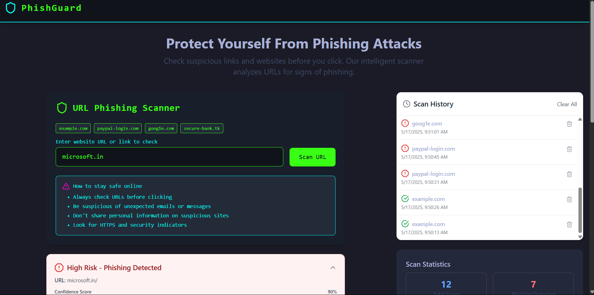

## 📘 GitHub `README.md`

```markdown
# 🛡️ PhishGuard - Phishing URL Detector




PhishGuard is an intelligent phishing URL detection tool powered by machine learning. It helps users scan suspicious links in real-time, providing detailed threat insights and actionable safety tips.



---

## 🔍 Features

- 🔗 Real-time phishing link scanning
- 🤖 Machine Learning-based detection engine
- 🛑 Red flag indicators for suspicious domains
- 💬 Confidence score and scan results
- 🧠 Online safety tips & awareness content
- 🕓 Scan history tracking
- 🌙 Modern dark-themed user interface

---

## 🛠️ Tech Stack

- **Frontend**: HTML, CSS, JavaScript
- **Backend**: Python
- **ML Model**: Scikit-learn (e.g., Decision Tree / Random Forest)
- **Deployment**: Localhost / Streamlit optional

---
# 🛡️ PhishGuard - vidoe demonstration of how website works


### ⚙️ Prerequisites

- Node.js (v16+)
- npm or yarn

---

### 🔧 Installation

```bash
git clone https://github.com/meenayaparala/phishGuard.git
cd phishGuard
npm install
npm run dev
````

Now open your browser at [http://localhost:5173](http://localhost:5173)

---


## 🔗 Sample URLs to Test

| URL                | Status      |
| ------------------ | ----------- |
| `example.com`      | ✅ Safe      |
| `goog1e.com`       | 🚨 Phishing |
| `paypal-login.com` | 🚨 Phishing |
| `secure-bank.tk`   | 🚨 Phishing |
| `microsoft.in`     | 🚨 Phishing |


---

## 🌐 Future Enhancements

* Add real-time phishing detection using an external API (e.g., Google Safe Browsing)
* Enable scan result export/download
* Implement user authentication and history sync
* Add mobile PWA support and notifications

---

## 🔐 Stay Safe Online Tips

* ✅ Always inspect URLs before clicking
* ❗ Be cautious with unexpected emails or links
* 🔒 Prefer HTTPS and secure site indicators
* 🚫 Don’t share credentials on unknown websites

---

## 🤝 Contributing

Contributions are welcome! Open an issue first to discuss your ideas or improvements.

1. Fork the repo
2. Create a new branch
3. Commit changes
4. Push to your branch
5. Open a pull request

---

## 🙌 Contributions Welcome

Feel free to fork, improve, or create issues. Help make the web a safer place!

---
Great! Here's your finalized `README.md` file ready for use. You can copy this into your project root directory as `README.md` and push it to GitHub.

---


## 📁 Project Structure

```
phishGuard/
├── public/
├── src/
│   ├── components/
│   ├── pages/
│   ├── App.jsx
│   └── main.jsx
├── .gitignore
├── package.json
└── README.md
```


## 📄 License

This project is licensed under the [MIT License](LICENSE).

---

## 👩‍💻 Author

Developed  by **Meena Kumari Yaparala**

GitHub: [@meenayaparala](https://github.com/meenayaparala)


